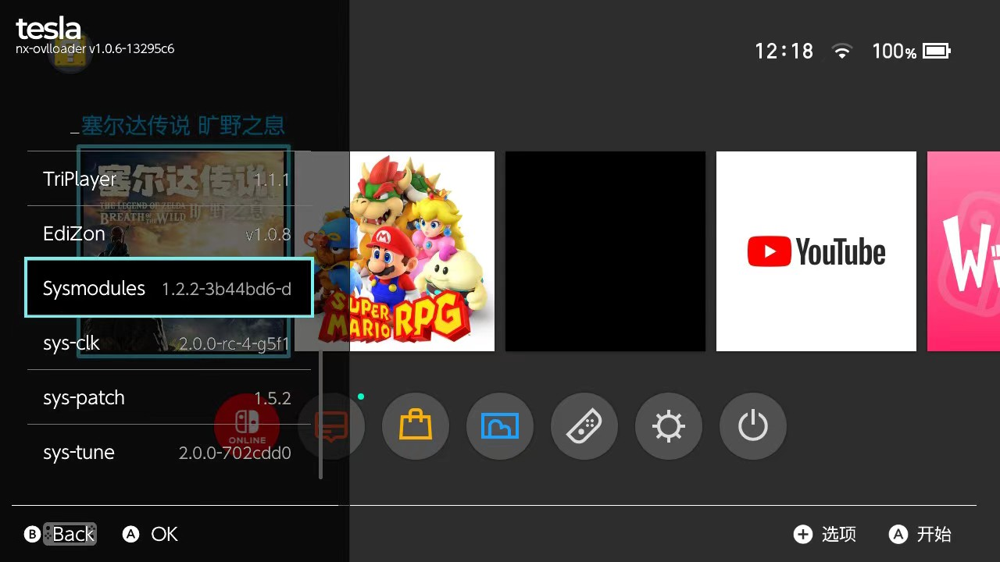
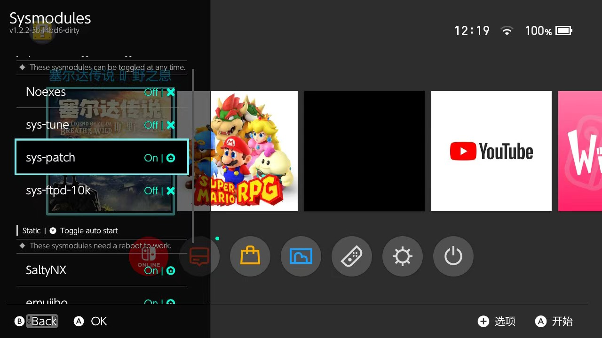

## ATM_ZxNs 
####  一个个人自用的大气层整合包.
### 说明
Tesla 快捷键: L + UP

### 配置
#### 首次使用 需要 
1. L + UP 唤出 Tesla
   
2. 找到 Sysmodules
   
3. 找到 sys-patch 
   
    按 Y 开启自启.
    按 A, off 变成 on.
 
**第一次使用执行以上即可.**
 
 
 
 
 All of Resources from:
```
  "Atmosphere-NX/Atmosphere"
  "CTCaer/hekate"
  "zerofo/nx-ovlloader"
  #"WerWolv/nx-ovlloader"
  #"ppkantorski/Ultrahand-Overlay"
  "zerofo/Tesla-Menu"
  "XorTroll/emuiibo"
  "masagrator/ReverseNX-RT"
  "masagrator/ReverseNX-Tool"
  "masagrator/Status-Monitor-Overlay"
  "masagrator/SaltyNX"
  "masagrator/SaltyNX-Tool"
  "HookedBehemoth/sys-tune"
  "DefenderOfHyrule/TriPlayer"
  #"zerofo/MissionControl"
  "ndeadly/MissionControl"
  "retronx-team/sys-clk"
  "SegFault42/sys-ftpd-ovl"
  "zerofo/fastCFWswitch"
  "zerofo/ovl-sysmodules-action"
  "zerofo/sys-patch"
  "tomvita/Breeze-Beta"
  "fortheusers/hb-appstore"
  "tomvita/Zing"
  "masagrator/FPSLocker"
  #"zerofo/InfoNX"
  "zerofo/EdiZon-Overlay"
  #"proferabg/EdiZon-Overlay"
  "spacemeowx2/ldn_mitm"
  "nedex/QuickNTP"
  "xfangfang/wiliwili"
  "3096/switch-time"
  "HamletDuFromage/aio-switch-updater"
  "J-D-K/JKSV"
  "tomvita/EdiZon-SE"
  "XorTroll/Goldleaf"
  "vgmoose/vgedit"
  "lud99/botw-unexplored"
  "Huntereb/Awoo-Installer"
  "exelix11/SwitchThemeInjector"
  "joel16/NX-Shell"
  "rashevskyv/dbi"
  "Decscots/Lockpick_RCM"
  "suchmememanyskill/TegraExplorer"
```
